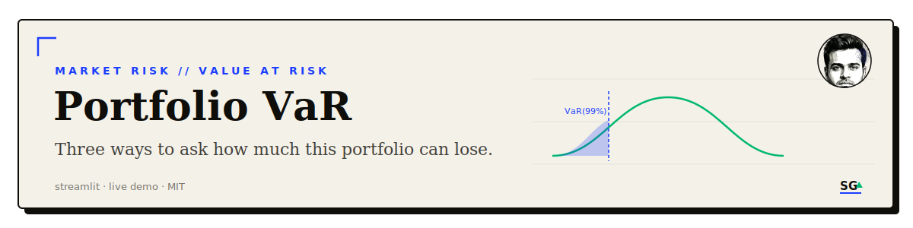

<div align="center">

<br/>


<a href="https://valueatriskmethod.streamlit.app/"></a>

<br/>
<sub><a href="#what-it-does">What it does</a> · <a href="#demo">Demo</a> · <a href="#install">Install</a> · <a href="#use">Use</a> · <a href="#how-it-works">How it works</a> · <a href="#license">License</a></sub>
</div>

---

## What it does
A Streamlit app that prices Value at Risk for a multi-stock portfolio, computed three ways:

- **Historical**: takes the empirical percentile of realized daily returns, no distributional assumption.
- **Variance-covariance**: assumes normally distributed returns, derives VaR from the mean, standard deviation, and a z-score.
- **Monte Carlo**: draws 10,000 simulated returns from a fitted normal distribution and takes the percentile of the simulated path.

Pick up to 10 tickers, set their weights, a date range, and a confidence level; the app fetches historical prices, builds a weighted return series, and reports VaR in dollar terms against your stated portfolio value.

## Demo
Live: [valueatriskmethod.streamlit.app](https://valueatriskmethod.streamlit.app/)

## Install
```bash
git clone https://github.com/sarthakguptaquant/portfolio-var.git
cd portfolio-var
pip install -r requirements.txt
```

You will also need an API key from [Financial Modeling Prep](https://financialmodelingprep.com/developer/docs/) to fetch stock price history.

## Use
```bash
streamlit run Model_Code.py
```
Then, in the app:
1. Set an initial portfolio value and pick up to 10 tickers with weights summing to 100%.
2. Choose a start and end date, click "Fetch Data and Calculate Statistics."
3. Pick a VaR method and confidence level, click "Calculate VaR."

## How it works

<details>
<summary><strong>Return construction</strong></summary>

Daily returns are computed per stock from fetched closing prices, scaled by each stock's weight, and concatenated into a single weighted return series that all three VaR methods operate on.
</details>

<details>
<summary><strong>Method table</strong></summary>

| Method | Key assumption / tradeoff |
|---|---|
| Historical | No distribution assumed, but only as good as the sample window: thin history means a noisy percentile. |
| Variance-covariance | Fast, closed-form, and wrong whenever returns are fat-tailed or skewed, which equity returns usually are. |
| Monte Carlo | Same normality assumption as variance-covariance, just resampled 10,000 times, so it inherits the same blind spot to tail risk. |
</details>

## License

[MIT](LICENSE).

---

<div align="center">

<br/>
<sub><a href="https://github.com/sarthakguptaquant">sarthakguptaquant</a> · AI x quantitative finance · <a href="https://sarthakgpt.com">sarthakgpt.com</a></sub>
</div>
